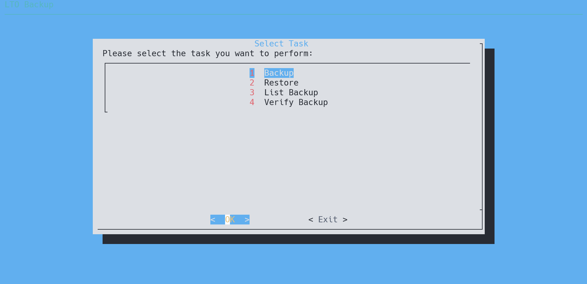

# LTO-Backup
A lightweight utility to help you backup files to LTO tapes.



## Dependencies

* dialog (terminal UI interface)
* lsscsi (tape detection)
* mbuffer (buffering processed data to tape to prevent shoe-shining)
* mt-st (magnetic tape control)
* calc (calculate size, estimate time/tape required)

## Usage

```
git clone https://github.com/r1cebank/LTO-Backup.git && cd LTO-Backup
sudo ./backup.sh
```

Then follow the UI interface to select your tape devices and tape type (tape type only used to estimate required tape for backup)

## Backup
After choosing a tape drive and backup source, the script will use tar and mbuffer to backup all content in the directory to tape, when the tape is full, it will eject the current tape and once new tape is loaded, back up will continue.

To check if script is waiting for tape, check the log with name `task-log*`

Backup will also generate file list at `label-date.lst` and the sha512 checksum at `label-date.sha512`. The sha512 checksum can be used later to verify the integrity of the entire backup.

## Restore
Before restore, script will ask you about encryption and compression, make sure you remember the compression setting and encryption key before restore, these setting need to match or restore is not possible. You will also need to provide the number of tapes this restore needs, this setting is fed to `mbuffer`

## Compression

The script defaults to use zstandard `zstd` for compression, the default compression level is 10.

## Encryption

The script will prompt you for enabling encryption before backup, you can choose to let script generate random key or provide an encryption key. Encryption key is generated with the following command:

```
openssl rand 512 > encryption.key
```

## Data Layout

The script will create two file on the first tape of the backup task, the first file will contain this script and the custom config used to backup, encryption key filename will be included as well. This is used to enable future restore without the need to cloning this project. The first file including the backup script, config can be extracted with the following command once tape is inserted and at 0 block.

```
sudo tar -xvf /dev/nst0 -C [your restore location]
```